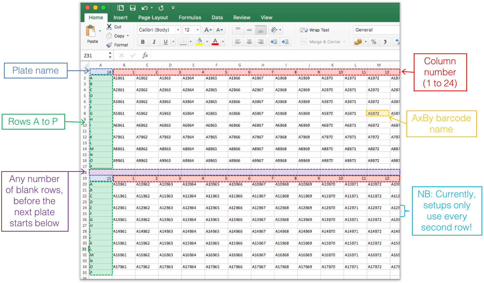

# User instruction

---

### 1. Sequencing Data
A **FASTQ** (or FASTA) file containing the raw sequencing reads.

---

### 2. Barcode Information

#### Sample Identification Tag
A FASTA file with sequences of the sample identification tags.  
- Sequence names must match the keys in the *Sample Identification Table*.

#### Forward Primer A
The sequence of the forward primer from **Oligo-A**.

#### N Sequence (UMI 1)
Provide an integer specifying the length of the first UMI (unique molecular identifier).

#### Epitope Tag A
Upload a FASTA file containing the 25-mer oligonucleotide sequences from **Oligo A**.

**Requirements:**
- No spaces in sequence names  
- Must end with `_Axx` (where `xx` is an ID number)

**Example:**

```
Oligo_A1
CGAGGGCAATGGTTAACTGACACGT
Oligo_A2
CAGAAAGCAGTCTCGTCGGTTCGAA
```

**Note** Other sequence lengths besides 25 are supported.

#### Annealing Region
Paste the sequence of the annealing region.

#### Epitope Tag B
Upload a FASTA file containing 25-mer sequences from **Oligo B**.

**Requirements:**
- Reverse strand/orientation relative to Oligo A  
- No spaces in sequence names  
- Must end with `_Byy` (where `yy` is an ID number)

**Example:**

```
Oligo_B1
GCCTGTAGTCCCACGCGATCTAACA
Oligo_B2
CAACCATTGATTGGGGACAACTGGG
```

Other sequence lengths besides 25 are supported.

#### N Sequence (UMI 2)
Provide an integer specifying the length of the second UMI.

#### Forward Primer B
Paste the sequence of the reverse primer from **Oligo-B**  
(reverse strand/orientation relative to Primer A).

---

### 3. Sample Identification

Upload a **tab-delimited file (no headers)** with the following format:

<key> <sample name> <experiment>

**Example:**

```
A-Key_2OS_F1_01	sampleA	1
A-Key_2OS_F1_02	sampleB	1
A-Key_2OS_F1_03	sampleX	2
A-Key_2OS_F1_04	sampleY	2
A-Key_2OS_F1_05	input	1
A-Key_2OS_F1_06	input	1
A-Key_2OS_F1_07	input	2
A-Key_2OS_F1_08	input	2
```

**Important:**
- `key` must match sequence names in the *Sample Identification Tag* FASTA file  
- Use `"input"` (lowercase) for control samples  
- `sample name` is used for labeling outputs  
- `experiment` defines grouping for analysis  

**Notes:**
- Samples are analyzed per experiment group  
- Use the same experiment value (e.g., `1`) for all rows if analyzing as a single experiment  

---

### 4. Barcode Annotations

Upload a **tab-delimited file with headers** containing barcode annotations.

Or upload a **Microsoft Excel workbook**, where:
- Each sheet is an annotation table  
- Sheet names must match experiment names from the sample identification table  

**Requirements:**
- First column: barcode name (e.g., `A1B2`)  
- Additional columns: optional metadata (e.g., peptide, sequence)  
- Avoid special symbols (e.g., Greek letters, URLs)


**Example:**

| Barcode | HLA allele | Peptide        | Sequence   |
|---------|------------|----------------|------------|
| A7B1    | HLA-A0201  | 707-AP         | RVAALARDAP |
| A7B2    | HLA-A0201  | ATIC (AICRT)   | RLDFNLIRV  |
| A7B3    | HLA-A0201  | ATIC (AICRT)   | MVYDLYKTL  |

---

### 5. Barcode Plate Setups (Optional)

Upload an Excel file describing how DNA barcodes were arranged on **384-well plates**.

This enables visualization of results as heatmaps that mimic plate layout, helping identify:
- Experimental errors  
- Spill-over between wells  
- Barcode misplacement  

Example of excel sheet:


